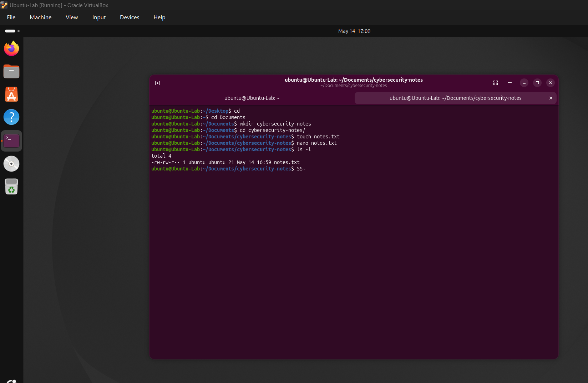

# Linux Basics Lab

## Objective
Practiced fundamental Linux terminal commands and file management operations using Ubuntu Linux virtual machine.

## Skills Learned
- Linux terminal navigation
- File and folder management
- Basic Linux permissions
- Command-line operations

## Commands Practiced
- pwd
- ls
- cd
- mkdir
- touch
- nano
- rm
- cat
- sudo

## Outcome
Developed foundational Linux administration and terminal navigation skills relevant to cybersecurity and system administration tasks.

## Screenshot

